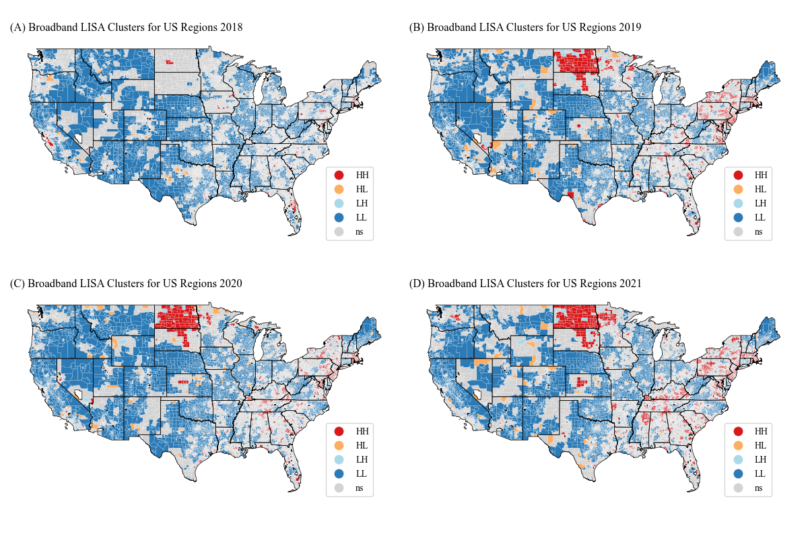

# Study of the US Broadband Deployment

## Overview

This project investigates the broadband deployment in the US, focusing on identifying cold spots (areas with less than FCC's 25Mbps standard) and their spatial and temporal evolution. For a visual representation, see the below image of LISA clusters from our analysis:

## Getting Started

1. Clone this repository to your local machine.
2. Navigate into the repository's parent directory.
3. Create a 'data' directory within the parent directory.
4. Download the dataset from [zenodo](https://zenodo.org/records/10258667/files/broadband.tar?download=1).
5. Unzip the downloaded files into the 'data' directory.
6. Set up the Python environment by running `conda env create -f environment.yml` in the terminal. This will install all necessary dependencies.
7. Activate the newly created environment using `conda activate [environment-name]`.
8. Navigate to the 'notebook' directory.
9. Run `jupyter notebook` to start the Jupyter Notebook and open the `data_analysis` notebook for analysis.

## Objectives

- **Spatial Analysis**: Mapping areas with low broadband speeds (cold spots) and high broadband speeds (hot spots).
- **Temporal Analysis**: Examining the changes in broadband coverage over time.

## Data Sources

- **FCC Broadband Data**: Information on ISP reported speeds.
- **Census Data**: Data on median income, urban population, education level, and broadband demand.

## Tools and Technologies

- **Python**: For data processing and analysis. Dependencies and environment can be set up using a provided `conda environment.yml` file.
